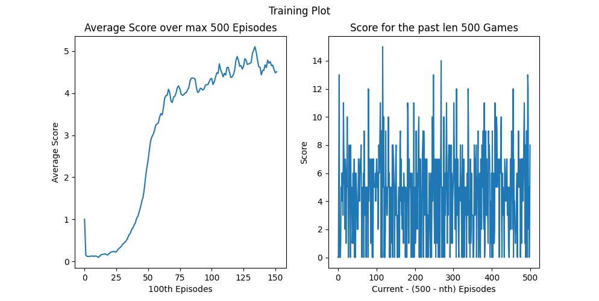

# AI Plays Snake: A Deep Q-Learning Project

This project aims to implement reinforcement algorithm, DQN, to the classic snake game using PyGame and PyTorch. Deep Q-Network is a method to use neural network to approximate the optimate action-value function through iterative real-life updates. The concept is inspired by the original DeepMind paper, "Playing Atari with Deep Reinforcement Learning". To explore the different kind of states, I have implement 3 major modes/types of states with its corresponding neural network. This allows experimentation with various input features from simple binary vectors to CNN latent vectors. 

A simplified web version is available for on-the-spot demonstration. Due to web incompatability with PyTorch, a open source tensorflow.js was used. 

## Features

- **Deep Q-Learning Core:** DQN algorithm with Experience Replay to train the agent.
- **Multiple Agent Modes:** Training available on three different state representations:
    - **`simple`**: A 11 dimentional vector describing essential features such as immediate dangers, snake direction, and relative food location.
    - **`sensor`**: A state vector derived from simulated "LIDAR" sensors that detect distances to walls, its own body, and food in various directions. Vector dimension can vary depending on view range. 
    - **`image`**: A Convolutional Neural Network (CNN) that learns to play directly from a stack of game frames, similar to the original DQN approach. 
- **Dynamic Training Visualization:** Real-time plotting of scores and average scores during training using `matplotlib`.
- **Model Saving:** Automatically saves the best-performing models during training and provides a simple script to load them for testing.

## How to Use

### Prerequisites

- Python 3.8+
- The packages listed in `requirements.txt`.

### Installation

1.  Clone the repository:
    ```bash
    git clone https://github.com/KCTaka/DQN-Snake.git
    cd DQN-Snake
    ```

2.  (Recommended) Create and activate a virtual environment:
    ```bash
    python -m venv venv
    # On Windows
    venv\Scripts\activate
    # On macOS/Linux
    source venv/bin/activate
    ```

3.  Install the required packages:
    ```bash
    pip install -r requirements.txt
    ```

4.  Create the directories for saving models and plots:
    ```bash
    mkdir models
    mkdir plots
    ```

### Training an Agent

The main script for training is `snake_main.py`. Training parameters can be configured in script.

1.  **Choose a Mode:** Open `snake_main.py` and in the `if __name__ == "__main__":` block, set the desired `mode` for training. The available modes are `"simple"`, `"sensor"`, and `"image"`.

    ```python
    # snake_main.py

    if __name__ == "__main__":
        game = SnakeGame(
            window_size=400,
            grid_size=8,
            # ... other game parameters
        )

        # Choose which model to train
        train_dqn(game, mode="simple") # or "sensor", "image"
    ```

2.  **Run the Training Script:**
    ```bash
    python snake_main.py
    ```
    The training progress will be printed to the console, and a plot will be updated in real-time. The best model for the session will be saved in the `models/` directory, and the final training plot will be saved in `plots/`.

### Testing a Trained Agent

To watch a pre-trained agent play the game, use the `test.py` script.

1.  **Choose a Model to Test:** Open `test.py` and set the `mode` variable to match the model you want to load. The script will automatically load the latest saved model for that mode.

    ```python
    # test.py

    if __name__ == "__main__":
        mode = "simple" # or "sensor", "image"
        test_model(mode)
    ```

2.  **Run the Test Script:**
    ```bash
    python test.py
    ```
    The trained agent will be shown playing the game. You can press `q` to end the current game and start a new one, or close the window to exit.

## Results

The performance of the agent varies significantly based on the state representation (`mode`) used for training. Below are sample training plots for each mode.

### Simple Mode

The `simple` mode uses an 11-dimensional feature vector. It learns very quickly due to the low-dimensional state but often plateaus at a moderate score, as its state representation lacks information to develop advanced strategies. It becomes easy for it to trap itself in itself. 


### Sensor Mode

The `sensor` mode uses a more complex state based on ray-casting sensors and food location. This provides more detailed information about the environment, allowing it to theoretically get better scores than the `simple` mode. It takes longer to train but navigates a little bit more strategically. However, in practice, probably due to how its implemented, it can't seem to outscore 'simple' mode. 


### Image Mode

The `image` mode uses a Convolutional Neural Network (CNN) to learn directly from a stack of down-sampled game frames. This approach is the most computationally intensive and requires more training data, which inexchange and theoretically should have the best score due to the completeness of information; however, it seems to not achieve as much as I expected. 

